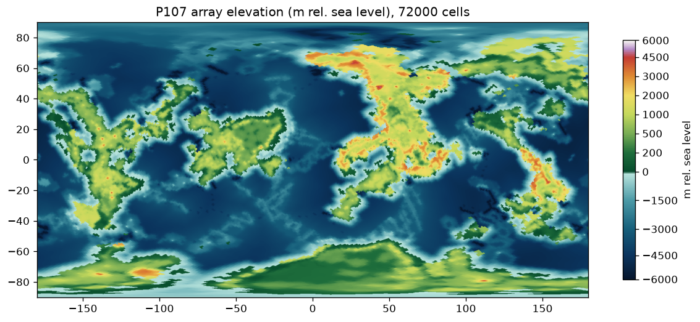
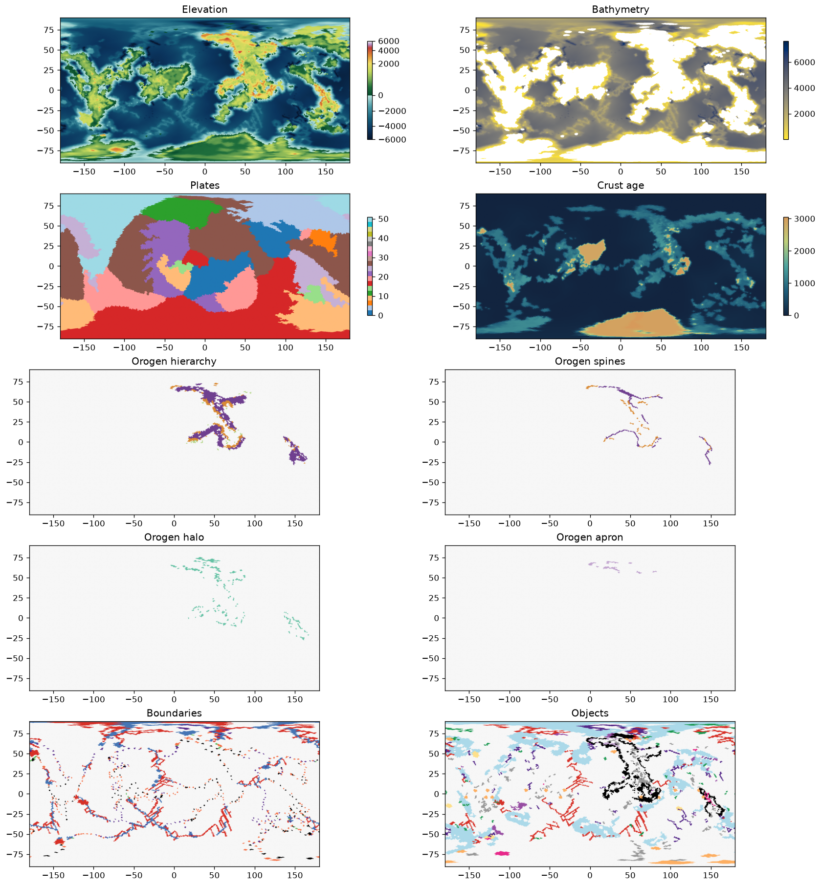
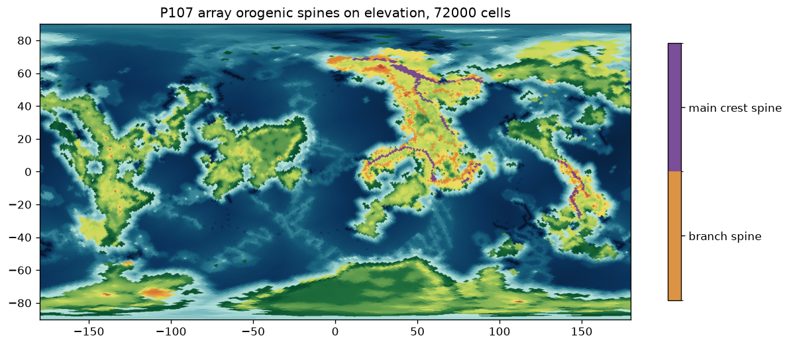
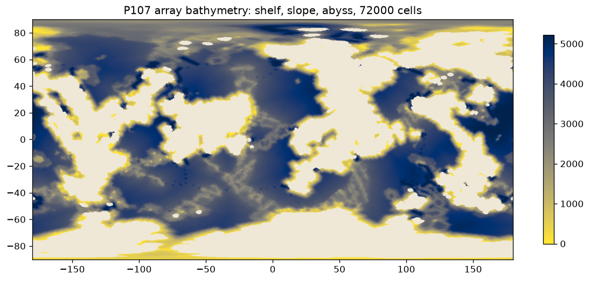
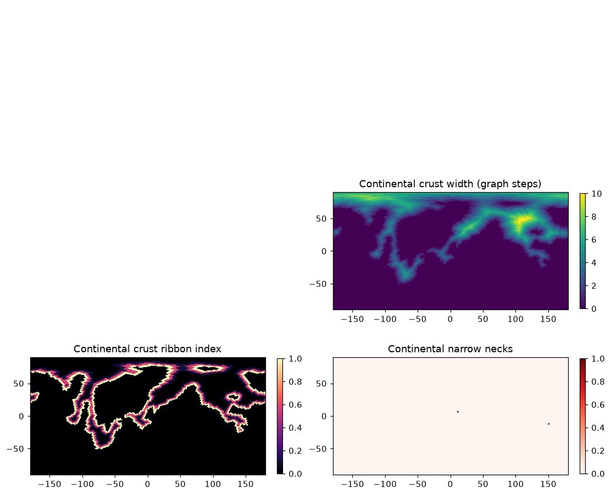

<p align="center">
  
</p>

# Aevum - Deep-Time Planet Engine, World Archive, And Strategy-Map Compiler

[中文 README](README.md) · [Documentation Index](docs/INDEX.md) · [Result Showcase](docs/RESULT_SHOWCASE.md)

Aevum is not just a map generator.  It is a causal world engine designed to
answer: **why did this place become this way?**  It evolves a planet from early
formation to a terminal world state, records the causal history, and compiles
the truth-layer planet into a Civilization-style hex strategy map.

Current status: **v0.1 research prototype**.  The codebase can run the full
deep-time pipeline, archive events and lineages, render terrain and diagnostic
layers, and compile a playable hex map.  The plate/terrain generation stage is
accepted for now; the next major work is climate and biome derivation through
real-Earth calibration and external climate-engine experiments.

## Current Handoff

For cluster work, start with:

- [Project handoff](docs/PROJECT_HANDOFF_20260708.md)
- [CPU cluster experiment plan](docs/CLUSTER_EXPERIMENT_PLAN_20260708.md)
- [Documentation index](docs/INDEX.md)

Current working decision:

- Plate and terrain generation are temporarily closed as the accepted upstream
  terrain input.
- The in-repo fast climate engine is frozen as a diagnostic prototype, not the
  final production climate path.
- Climate work should first fit real-Earth subgraphs, then derive monthly
  temperature/precipitation normals, Koppen classes, and biome maps.

## Result Showcase

More context and source paths are in [the showcase page](docs/RESULT_SHOWCASE.md).
Only a small curated set of real Aevum outputs is tracked in Git; the full local
`out*` experiment directories remain ignored.



### Latest Terrain Evolution Video

<video src="docs/assets/showcase/elevation_evolution_earthlike_seed42.mp4" controls width="100%" poster="docs/assets/showcase/elevation_72000_seed707.png"></video>

If your Markdown renderer does not embed the video, open the MP4 directly:
[elevation_evolution_earthlike_seed42.mp4](docs/assets/showcase/elevation_evolution_earthlike_seed42.mp4).
The source run is
`out_elevation_evolution_videos_6worlds_20260706/earthlike_seed42/`.

| Terrain diagnostics | Ocean-floor and orogen semantics |
|---|---|
|  |  |

| Bathymetry classes | Tectonic object layer |
|---|---|
|  |  |

Climate maps are intentionally not presented as final output.  The tracked
temperature, precipitation, and biome images are old fast-engine prototype
renders; the current plan is to calibrate against real Earth and external
climate models before promoting climate and biome products.

## Core Model

Aevum separates the world into three layers:

| Layer | Main objects | Role |
|---|---|---|
| Truth layer | `WorldState` | Physical-ish planet state: fields, networks, objects, and scalars |
| History layer | `WorldArchive` + `EventBus` | Events, lineage, stratigraphy, resources, and causal explanation |
| Game layer | `MapCompiler` | A lossy hex-grid strategy map with terrain, rivers, resources, yields, and starts |

Game balance happens only in the third layer.  It does not mutate the
truth-layer geology or climate.

## Architecture

```text
PlanetSpec -> FeatureRegistry -> WorldState -> DeepTimeScheduler
  -> stellar -> interior -> impacts -> tectonics -> terrain
  -> climate -> biogeochem -> biosphere -> resources
  -> WorldArchive -> MapCompiler -> validation and rendering
```

Important implementation points:

- feature contracts live in `aevum/core/registry.py`, `aevum/features.py`, and
  `data/registry/features.yaml`;
- reproducible randomness is handled by `aevum/core/rng.py`;
- the spherical grid is in `aevum/core/grid.py`;
- tectonics and terrain are in `aevum/modules/tectonics.py` and
  `aevum/modules/terrain.py`;
- climate is currently prototype-only in `aevum/modules/climate.py`;
- release gates and research diagnostics live under `aevum/diagnostics/`;
- tests live under `tests/`.

## Quick Start

```bash
python3 -m venv .venv
./.venv/bin/pip install -e .

# Run one Earth-like planet and write assets to out/
./.venv/bin/python -m aevum.cli run \
  --preset earthlike \
  --cells 8000 \
  --out out

# List baseline worlds
./.venv/bin/python -m aevum.cli presets

# Inspect the feature registry
./.venv/bin/python -m aevum.cli registry
```

Typical outputs include:

- `elevation.png`, `plates.png`, `crust_age.png`;
- `temperature.png`, `precip.png`, `biomes.png` from the frozen prototype path;
- `hexmap.png` for the compiled strategy map;
- `history.png` and `timeline.png`;
- `timeline.json`, `lineages.json`, `spec.json`, and explanation examples.

## Baseline Worlds

Defined in `aevum/spec/presets.py`:

- `earthlike`
- `waterworld`
- `arid`
- `stagnant_lid`
- `tidally_locked`
- `frozen`

Earth is a calibration target, not the only design target.

## Validation

Aevum should not only look plausible.  The test and diagnostic suite checks:

- conservation, such as carbon inventory closure;
- topology, such as plate coverage and river connectivity;
- causal provenance, such as mountain and deposit origins;
- fixed-seed reproducibility;
- cross-world behavior across the six baseline worlds.

Known handoff status: one local macOS test run was interrupted after 23:20 with
`141 passed, 3 failed`; the failures are documented in
[the project handoff](docs/PROJECT_HANDOFF_20260708.md).  Cluster runs should
rerun the full suite before new climate-engine experiments.

## Roadmap

Completed enough for the current handoff:

- feature registry and world-state skeleton;
- full low-fidelity deep-time pipeline;
- event archive, lineage, and causal explanation surfaces;
- plate/terrain closure sufficient for downstream climate experiments;
- curated GitHub showcase and cluster handoff documentation.

Next priorities:

- reproduce terrain baselines on the CPU cluster;
- keep plate generation frozen unless a climate blocker is clearly terrain-owned;
- evaluate external climate engines, starting with ExoPlaSim;
- fit real-Earth subgraphs in dependency order;
- derive Koppen and biome maps from monthly climate normals;
- keep large raw data and generated experiments outside normal Git history.

## Design Rules

- Do not hard-code Earth events; model event-generating mechanisms.
- Do not directly paint mountains, deserts, or resources from noise.
- Keep truth state, archive, and compiled game map separate.
- Use visual map comparison and residual attribution before optimizing climate
  metrics.
- Store reproducible plans and small showcase artifacts in Git; keep large
  outputs in external storage or regenerated `out*` directories.
