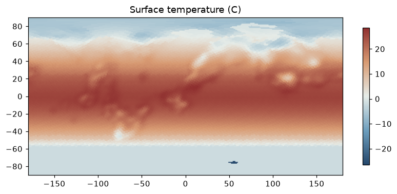
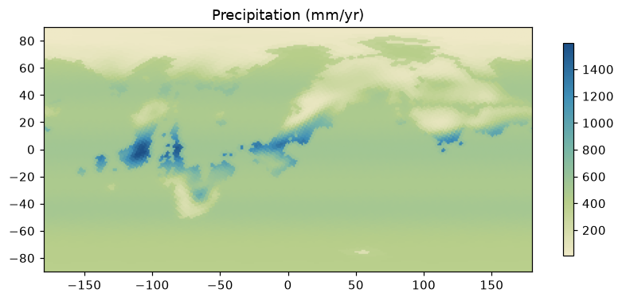
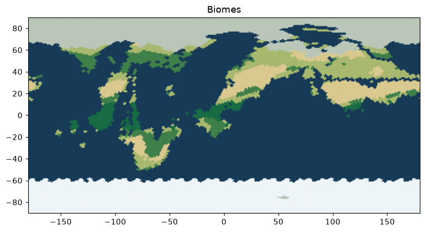

# Aevum Result Showcase

This page records a small, curated set of real Aevum outputs that are safe to
keep in Git.  The full local workspace contains many large `out*` experiment
directories; those remain ignored and should be reproduced or stored outside
normal Git history.

## Logo

The logo is a project-native SVG: a layered planet, an orbit/timeline arc, and
a wordmark.  It is meant for GitHub README use and does not depend on a raster
export.

## Current Terrain Snapshot

Source:
`out_selected_snapshot_72000_refinement_seed707_v13_default_river_objects_20260706/rendered/elevation.png`

This is a selected 72000-cell terminal terrain snapshot.  It shows the current
terrain direction after the plate/terrain closure work: broad continental
domains, visible shelves and abyssal structure, coherent highland belts, and
more varied continental interiors than the early generator.

## Terrain Diagnostic Contact Sheet

Source:
`out_selected_snapshot_72000_refinement_seed707_v13_default_river_objects_20260706/rendered/p107_array_contact_sheet.png`

This contact sheet is the compact way to inspect the current terrain semantics:
elevation, bathymetry, plates, crust age, orogenic hierarchy, orogenic spines,
boundary evidence, and object masks.

## Ocean Floor And Orogenic Structure

Source:
`out_selected_snapshot_72000_refinement_seed707_v13_default_river_objects_20260706/rendered/bathymetry_shelf_slope_abyss.png`

Source:
`out_selected_snapshot_72000_refinement_seed707_v13_default_river_objects_20260706/rendered/orogenic_hierarchy_spine_overlay.png`

These are still intermediate semantic layers, not final cartography.  Their
job is to make the geologic ownership of terrain visible: shelves, slopes,
abyssal plains, ridges, trenches, main orogenic belts, branch ranges, halos,
and related objects.

## Tectonic Object Layer

Source:
`out_terminal_climate_replay_f5spatial1_render_20260705/earthlike_seed42/tectonic_objects.png`

The object layer is the contract between process history and rendered terrain.
Objects are intended to carry stable meaning, such as ridges, trenches, island
arcs, cratons, passive margins, orogenic belts, plateaus, microcontinents, and
ocean-floor fabric.

## Frozen Climate Prototype

The following maps come from the in-repo fast climate prototype.  They are
included only to show the existing rendering surface and downstream targets.
They are not the accepted production climate path.

Source directory:
`out_terminal_climate_replay_f5spatial1_render_20260705/earthlike_seed42/`

Current climate direction is documented in
`EARTH_BASED_CLIMATE_FITTING_PLAN.md` and
`CLIMATE_MECHANISM_MODELING_PLAN.md`: fit real-Earth subgraphs first, use
external climate engines for physically stronger monthly climate normals, then
derive Koppen and biome maps through postprocessing.
